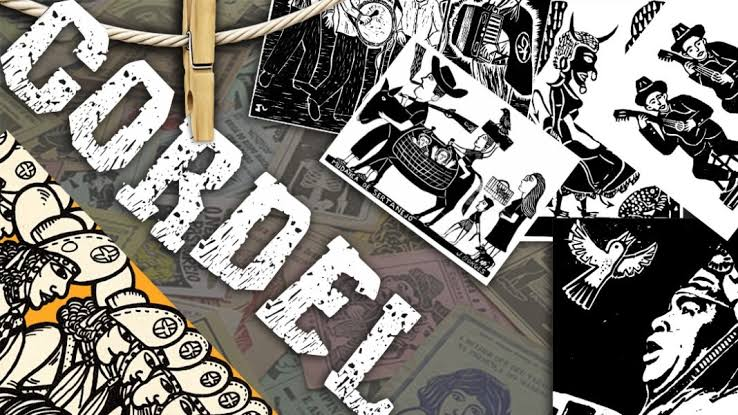

###   Projeto Cordel Moderno. 

​                                                                    
##### Direitos Reservados a Milton Duarte.

Esse projeto foi feito no curso do professor Gustavo Guanabara. Módulo 3 de HTML e CSS.

###### Tecnologias Usadas.

- `HTML`

- `CSS`

  

:link:[Página do website](https://abreu-marcelo.github.io/Projeto-Cordel/)

