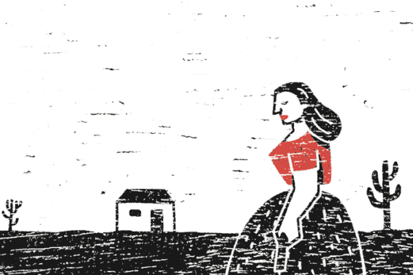

 <h1 align="center">
  ©️ Cordel Moderno
</h1>

## 📝 Descrição 

Literatura de cordel, projeto desenvolvido durante o curso de HTML e CSS do curso em vídeo.

- Versão Final: [Cordel Moderno](https://marcelo-abreeu.github.io/Projeto-Cordel/)

## 🚀 Tecnologias

Esse projeto foi desenvolvido com as seguintes tecnologias:

- HTML
- CSS

## 📚 Bibliotecas

- [Google Fonts](https://fonts.google.com/)

-----

  <h3 align="center"> Developed by <a href="#">Marcelo Abreu</a> ☕</h3>                                 
